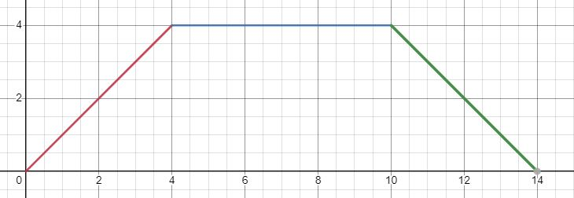
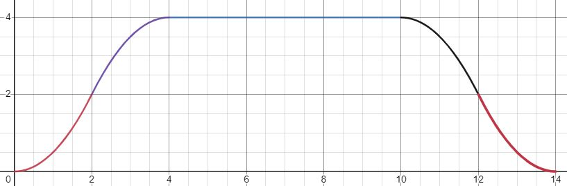

# motion_generators.hpp

## Overview

This file contains the four motion generators which are needed for the robot to move:

* MotionGenerator
* CartesianMotionGenerator
* ForceMotionGenerator
* SmoothCartesianMotionGenerator

Each of these motion generators have a different purpose and are used at different points in the gear_place_classes and robot_commander.

## Important functions

* MotionGenerator

    This motion generator takes in a vector of desired joint positions. It then moves to these joint positions.

* CartesianMotionGenerator

    This is the first of the two cartesian motion generators. It is the simpler of the two, as the velocity piecewise contains three straight lines. It takes in xyz coordinates, acceleration, and a maximum velocity and moves the end effector to those xyz values. This is the graph of what the velocity function looks like, where the area below the graph is the total distance of the movement:

    

    In this movement, there are sharp corners, which means that the robot changes its velocity quickly, which can lead to reflex issues with the joints. 

* ForceMotionGenerator

    This motion generator takes in a desired force and moves the robot down a very small amount. It stops if the force controller senses that the robot is not moving down. This means that the gear the robot is holding is on the surface below. The robot can then open the gripper and move up to its original position. Most of this code is from the LibFranka examples.

* SmoothCartesianMotionGenerator

    This is the second of the two cartesian motion generator. Unlike the other one, this one uses 5 lines to form the velocity piecewise function. These lines allow the function to not have any sharp corners, meaning that there are no joint reflex issues. This is the graph for the velocity:

    